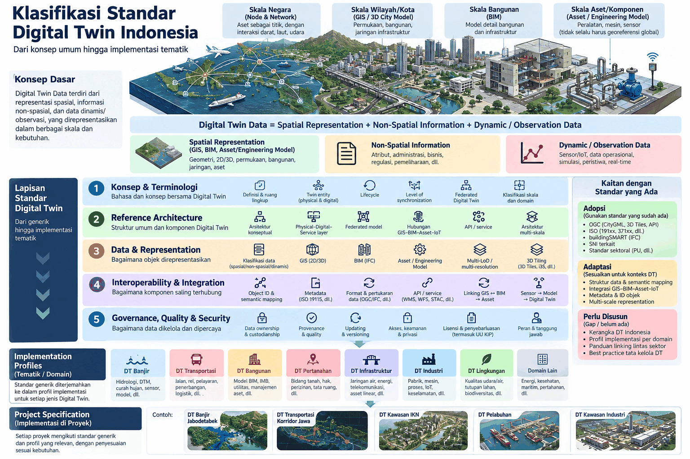

# DT-F-01 — Kerangka Klasifikasi Standar Digital Twin Indonesia

| | |
|---|---|
| **Kode** | DT-F-01 |
| **Jenis** | Framework |
| **Versi** | 0.1 |
| **Status** | Draf |
| **Tanggal** | 2026-09-25 |
| **Asal** | Hasil diskusi Pokja 1 |
| **Koordinator dokumen** | *(diisi)* |
| **Penyusun** | *(diisi)* |

> **Draf.** Dokumen ini merekam hasil diskusi Pokja 1 dan belum melalui tinjauan internal
> maupun tinjauan publik. Isinya masih dapat berubah.

---

## 1. Ruang lingkup

Dokumen ini menetapkan **kerangka klasifikasi** untuk menata pekerjaan standardisasi Digital Twin
di Indonesia: bagaimana standar disusun berlapis dari konsep umum sampai spesifikasi proyek, dan
bagaimana hubungannya dengan standar yang sudah ada.

**Termasuk:**

- Definisi komponen data Digital Twin dan klasifikasi skalanya
- Lima lapisan standar, dari terminologi sampai tata kelola
- Pembagian sikap terhadap standar yang sudah ada: adopsi, adaptasi, atau perlu disusun
- Kerangka profil implementasi per domain dan spesifikasi proyek

**Tidak termasuk:**

- Isi teknis tiap standar — akan disusun sebagai dokumen tersendiri
- Penetapan prioritas dokumen mana yang dikerjakan lebih dulu — diputuskan pengurus Pokja

## 2. Konsep dasar

> **Digital Twin Data = Spatial Representation + Non-Spatial Information + Dynamic / Observation Data**

Data Digital Twin terdiri dari representasi spasial, informasi non-spasial, dan data
dinamis/observasi, yang direpresentasikan dalam berbagai skala dan kebutuhan.

| Komponen | Isi |
|---|---|
| **Spatial Representation** (GIS, BIM, Asset/Engineering Model) | Geometri, 2D/3D, permukaan, bangunan, jaringan, aset |
| **Non-Spatial Information** | Atribut, administrasi, bisnis, regulasi, pemeliharaan, dll. |
| **Dynamic / Observation Data** | Sensor/IoT, data operasional, simulasi, peristiwa, *real-time* |

## 3. Klasifikasi skala

| Skala | Representasi | Cakupan |
|---|---|---|
| **Skala Negara** | Node & Network | Aset sebagai titik, dengan interaksi darat, laut, udara |
| **Skala Wilayah/Kota** | GIS / 3D City Model | Permukaan, bangunan, jaringan infrastruktur |
| **Skala Bangunan** | BIM | Model detail bangunan dan infrastruktur |
| **Skala Aset/Komponen** | Asset / Engineering Model | Peralatan, mesin, sensor (tidak selalu harus georeferensi global) |

Catatan penting pada skala aset/komponen: model rekayasa sering memakai sistem koordinat lokal,
sehingga **tidak selalu harus** terikat georeferensi global. Ketentuan penautannya diatur pada
Lapisan 4.

## 4. Lima lapisan standar

Disusun dari generik hingga implementasi tematik. Lapisan yang lebih atas menjadi dasar bagi
lapisan di bawahnya.

### Lapisan 1 — Konsep & Terminologi

*Bahasa dan konsep bersama Digital Twin.*

- Definisi & ruang lingkup
- Twin entity (*physical* & *digital*)
- Lifecycle
- Level of synchronization
- Federated Digital Twin
- Klasifikasi skala dan domain

### Lapisan 2 — Reference Architecture

*Struktur umum dan komponen Digital Twin.*

- Arsitektur konseptual
- Physical–Digital–Service layer
- Federated model
- Hubungan GIS–BIM–Asset–IoT
- API / service
- Arsitektur multi-skala

### Lapisan 3 — Data & Representation

*Bagaimana objek direpresentasikan.*

- Klasifikasi data (spasial / non-spasial / dinamis)
- GIS (2D/3D)
- BIM (IFC)
- Asset / Engineering Model
- Multi-LoD / multi-resolution
- 3D Tiling (3D Tiles, I3S, dll.)

### Lapisan 4 — Interoperability & Integration

*Bagaimana komponen saling terhubung.*

- Object ID & semantic mapping
- Metadata (ISO 19115, dll.)
- Format & pertukaran data (OGC/IFC, dll.)
- API / service (WMS, WFS, STAC, dll.)
- Linking GIS ↔ BIM → Asset
- Sensor → Model → Digital Twin

### Lapisan 5 — Governance, Quality & Security

*Bagaimana data dikelola dan dipercaya.*

- Data ownership & custodianship
- Provenance & quality
- Updating & versioning
- Akses, keamanan & privasi
- Lisensi & penyebarluasan (termasuk UU KIP)
- Peran & tanggung jawab

## 5. Kaitan dengan standar yang ada

Pokja 1 tidak menyusun dari nol. Setiap kebutuhan standar dipilah ke salah satu dari tiga sikap
berikut.

### 5.1 Adopsi — gunakan standar yang sudah ada

| Sumber | Contoh |
|---|---|
| OGC | CityGML, 3D Tiles, OGC API |
| ISO | seri 191xx, 371xx, dll. |
| buildingSMART | IFC |
| SNI | standar nasional terkait |
| Standar sektoral | Kementerian PU, dll. |

### 5.2 Adaptasi — sesuaikan untuk konteks Digital Twin

- Struktur data & semantic mapping
- Integrasi GIS–BIM–Asset–IoT
- Metadata & ID objek
- Multi-scale representation

### 5.3 Perlu disusun — celah yang belum tertutupi

- Kerangka Digital Twin Indonesia
- Profil implementasi per domain
- Panduan linking lintas sektor
- Best practice tata kelola Digital Twin

> Bagian 5.3 inilah yang menjadi **antrean kerja utama** Pokja 1.

## 6. Profil implementasi (tematik / domain)

Standar generik diterjemahkan ke dalam profil implementasi untuk setiap jenis Digital Twin.

| Profil | Cakupan data khas |
|---|---|
| **DT Banjir** | Hidrologi, DTM, curah hujan, sensor, model |
| **DT Transportasi** | Jalan, rel, pelayaran, penerbangan, logistik |
| **DT Bangunan** | Model BIM, IMB, utilitas, manajemen aset |
| **DT Pertanahan** | Bidang tanah, hak, perizinan, tata ruang |
| **DT Infrastruktur** | Jaringan air, energi, telekomunikasi, aset linear |
| **DT Industri** | Pabrik, mesin, proses, IoT, keselamatan |
| **DT Lingkungan** | Kualitas udara/air, tutupan lahan, biodiversitas |
| **Domain lain** | Energi, kesehatan, maritim, pertahanan, dll. |

## 7. Spesifikasi proyek

Setiap proyek mengikuti standar generik dan profil yang relevan, dengan penyesuaian sesuai
kebutuhan.

Contoh penerapan yang dibahas: DT Banjir Jabodetabek · DT Transportasi Koridor Jawa ·
DT Kawasan IKN · DT Pelabuhan · DT Kawasan Industri.

Hubungan dengan Pokja 2: pilot project yang berjalan berada pada tingkat **spesifikasi proyek**,
dan temuannya menjadi bahan perbaikan profil dan standar generik di atasnya.

## 8. Cara memakai kerangka ini

| Kebutuhan | Langkah |
|---|---|
| Mengusulkan topik standar baru | Tentukan lapisannya (1–5) dan sikapnya (adopsi/adaptasi/perlu disusun) pada [formulir usulan](https://github.com/idtc-id/pokja1-handbook/blob/main/templates/usulan-topik.md) |
| Menyusun profil domain | Rujuk lapisan 1–5, sebutkan bagian mana yang dipakai apa adanya dan mana yang dispesifikkan |
| Memulai proyek Digital Twin | Identifikasi skala, komponen data, dan profil domain yang berlaku |

## 9. Riwayat versi

| Versi | Tanggal | Perubahan |
|---|---|---|
| 0.1 | 2026-09-25 | Draf awal — merekam hasil diskusi Pokja 1 dalam bentuk dokumen |

## 10. Kontributor & pernyataan kepentingan

| Nama | Instansi | Unsur | Pernyataan kepentingan |
|---|---|---|---|
| | | Pemerintah / Industri / Akademisi | |

*Diisi oleh koordinator dokumen berdasarkan peserta diskusi yang menyusun kerangka ini.*

## 11. Hal yang masih perlu diputuskan

Dicatat agar tidak hilang saat draf ini dilanjutkan:

- [ ] Penamaan resmi tiap lapisan dalam Bahasa Indonesia (saat ini sebagian masih istilah Inggris)
- [ ] Batas tegas antara *adaptasi* dan *perlu disusun* untuk beberapa butir
- [ ] Apakah klasifikasi skala perlu tingkat kelima (mis. skala regional/lintas provinsi)
- [ ] Urutan prioritas profil domain mana yang disusun lebih dulu
- [ ] Bentuk keterkaitan formal dengan SNI dan Satu Data Indonesia

## 12. Lampiran

- [Infografik kerangka klasifikasi](gambar/klasifikasi-standar-dt-indonesia.png)
